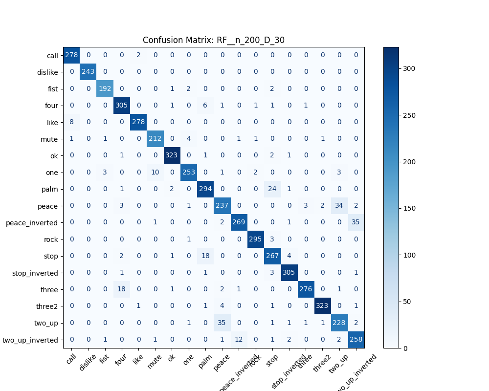
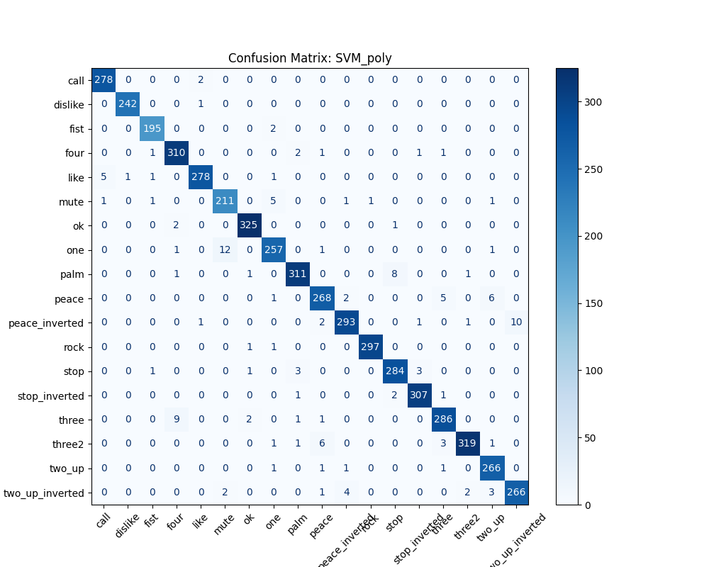

#  Hand Gesture Classification with MLflow Tracking

## Project Overview

This project focuses on the classification of hand gestures using landmark data from the **HaGRID** (Hand Gesture Recognition Image Dataset). By utilizing **MediaPipe**, 21 distinct hand landmarks (representing $x, y, z$ coordinates) were extracted to serve as the feature set for training supervised machine learning models.

The goal was to develop a reproducible pipeline—fully integrated with **MLflow**—for data preprocessing, model tuning, and evaluation. This experiment tracking system was used to systematically log hyperparameters, performance metrics, and model artifacts to identify the most accurate architecture for recognizing 18 different gesture classes.

---

##  The MLflow Experimentation Pipeline
The project implements a **Manual Parameter Sweep** using nested loops to systematically evaluate dozens of configurations across three different model families.

### 1. Model Search Space
* **SVM:** Testing of `linear`, `rbf`, and `poly` kernels with various $C$ values, gamma values and polynomial degrees.
* **Random Forest:** Evaluation of forest size (`n_estimators`) and maximum tree depth.
* **KNN:** Benchmarking of neighbor counts ($k$) to find the optimal balance between bias and variance.

### 2. Automated Logging
For every training iteration, MLflow captures:
* **Metrics:** Accuracy, Precision, Recall, and F1-Score.
* **Artifacts:** A high-resolution **Confusion Matrix** image for visual error analysis.
* **Signatures:** Inferred model schemas to ensure consistent input/output formatting during deployment.

---

##  Performance Leaderboard
Below is the summary of the top-performing models:

| Model | Key Parameters | Accuracy | F1-Score | 
| :--- | :--- | :--- | :--- |
| **SVM** | `kernel=poly, C=100, degree=2` | **0.972** | **0.972** |
| **Random Forest** | `n_estimators=200, max_depth=30` | 0.942 | 0.942 | 
| **KNN** | `n_neighbors=3` | 0.903 | 0.905 |

---

##  Visual Analysis: Confusion Matrices
MLflow logs a high-resolution Confusion Matrix for every individual run. Below is a comparison of the error distributions for the three evaluated model families.

### Random Forest
The Random Forest model ($n=200, D=30$) served as a robust competitor. While it accurately classifies 18 categories, the matrix below highlights specific challenges in distinguishing between gestures with similar finger extensions (e.g., `peace` vs. `two_up`).

### K-Nearest Neighbors (KNN)
The KNN model ($k=3$) exhibited higher prediction noise, specifically struggling to differentiate between gestures with similar landmark densities such as peace and two_up, peace_inverted and two_up_inverted and to distinguish between inverted and non-inverted gesture pairs.

##  Best Model (Registered): SVM Confusion Matrix
The chart below highlights the performance of the champion **SVM** model. The strong diagonal trend confirms high precision across the 18 gesture classes.

---

##  Dataset Information
* **Source:** HaGRID (Hand Gesture Recognition Image Dataset)
* **Input:** 21 Landmarks per hand (MediaPipe output).
* **Classes:** 18 gesture categories :
 call, dislike, fist, four, like, mute, ok, one, palm, peace, peace_inverted, rock, stop, stop_inverted, three, three2, two_up, two_up_inverted.

---

##  Project Structure
* **`Data Preprocessing.ipynb`** :The primary notebook containing the complete data preprocessing pipeline.
* **`Training and Evaluation using mlflow.ipynb`**: The notebook that contains the manual parameter sweep loops used to evaluate various hyperparameter configurations.
* **`train_with_mlflow.py`**: A dedicated helper script containing the `log_experiment_run` function for MLflow integration.