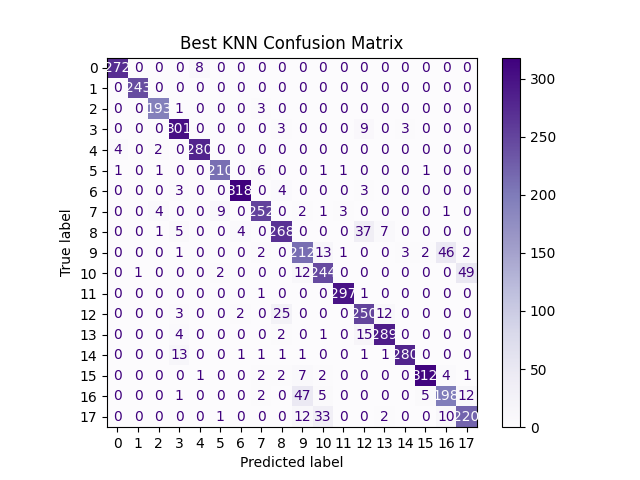

# Hand Gesture Classification

##  Project Overview
This project focuses on the classification of hand gestures using landmark data from the **HaGRID** (Hand Gesture Recognition Image Dataset). By utilizing **MediaPipe**, 21 distinct hand landmarks (representing $x, y, z$ coordinates) were extracted to serve as the feature set for training supervised machine learning models.

The goal was to develop a reproducible pipeline for data preprocessing, model tuning, and evaluation to identify the most accurate system for recognizing 18 different gesture classes.

##  Technical Process
The project followed a structured machine learning lifecycle to ensure a reliable classification system:

* **Data Loading:** Successfully imported the landmark coordinates and gesture labels from the CSV dataset.
* **Data Visualization:** Performed exploratory analysis by plotting keypoint samples to verify hand geometry and data quality.
* **Data Preprocessing:** Cleaned and prepared the data by handling missing values, normalizing coordinates, and splitting the dataset into training, validation and testing sets.
* **Model Training:** Implemented and benchmarked three algorithms: **Support Vector Machine (SVM)**, **Random Forest**, and **K-Nearest Neighbors (KNN)**.
* **Evaluation:** Conducted a detailed performance analysis using **Accuracy, Precision, Recall,** and **F1-Score**.
* **Conclusion:** Summarized results to select the best-performing model for final deployment
##  Performance Results
The evaluation was based on Accuracy, Recall, and F1-Score. The **SVM** model achieved the highest performance across all metrics.

### Model Comparison Table
| Model | Best Hyperparameters | Accuracy | Recall | F1-Score |
| :--- | :--- | :--- | :--- | :--- |
| **SVM** | Kernel=Poly, C=100.0, degree=2.0, Gamma=1.0 | **0.9723** | **0.9725** | **0.9722** |
| **Random Forest** | Trees=200, Depth=30.0 | 0.9418 | 0.9422 | 0.9420 |
| **KNN** | Neighbors=3 | 0.9034 | 0.9049 | 0.9046 |

### Final Conclusion
The **SVM with a Polynomial Kernel** is the superior model for this dataset, achieving an F1-Score of **97.22%**. It demonstrates high robustness in distinguishing between complex gesture classes with minimal error.

##  Error Analysis
Confusion matrices were generated to visualize the classification performance for each model. These charts represent how accurately the models predicted the validation data.

### 1. SVM (Top Performing)
The SVM shows a strong diagonal, indicating high precision for nearly all 18 gesture classes.

### 2. Random Forest

### 3. K-Nearest Neighbors

##  Dataset Information
* **Source:** HaGRID (Hand Gesture Recognition Image Dataset)
* **Input:** 21 Landmarks per hand (MediaPipe output).
* **Classes:** 18 gesture categories :
* call, dislike, fist, four, like, mute, ok, one, palm, peace, peace_inverted, rock, stop, stop_inverted, three, three2, two_up, two_up_inverted.
